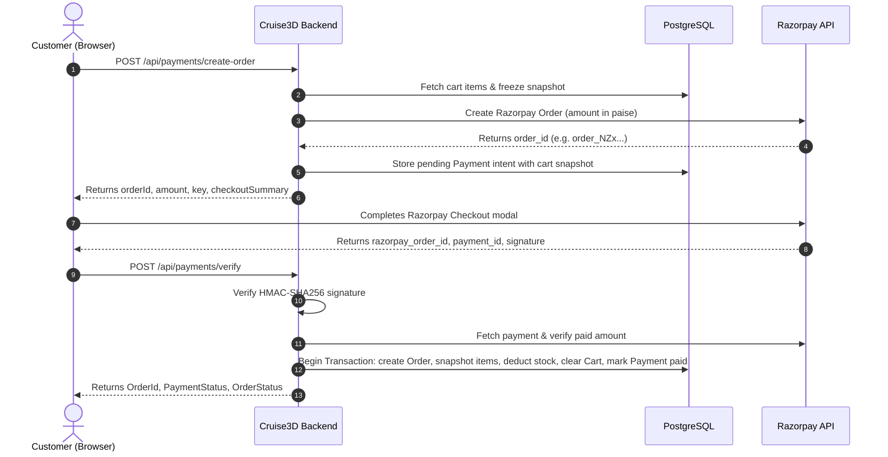

# Cruise3D Backend API Documentation

Welcome to the **Cruise3D Web API** frontend and developer reference.
This document provides request/response schemas, authentication requirements, query parameters, error responses, and workflow guides for all available endpoints.

---

## 📑 Table of Contents

1. [Base Information & Conventions](#-base-information--conventions)
2. [Standard Response Wrapper](#-standard-response-wrapper)
3. [Common HTTP Status Codes](#-common-http-status-codes)
4. [Authentication & Email Verification (`/api/auth`)](#1-authentication--email-verification-apiauth)
5. [Customer Address Management (`/api/addresses`)](#2-customer-address-management-apiaddresses)
6. [Product Catalog & Management (`/api/products`)](#3-product-catalog--management-apiproducts)
7. [Categories Catalog (`/api/categories`)](#4-categories-catalog-apicategories)
8. [Shopping Cart (`/api/cart`)](#5-shopping-cart-apicart)
9. [Orders & DTDC Courier Tracking (`/api/orders`)](#6-orders--dtdc-courier-tracking-apiorders)
10. [Payments & Razorpay Checkout (`/api/payments`)](#7-payments--razorpay-checkout-apipayments)
11. [Promotional Offers & Marquee Banner (`/api/offers`)](#8-promotional-offers--marquee-banner-apioffers)
12. [FCM Push Notifications & Device Tokens (`/api/notification-tokens`, `/api/notifications`)](#9-fcm-push-notifications--device-tokens)
13. [Media & Image Uploads (`/api/upload`)](#10-media--image-uploads-apiupload)
14. [Product Reviews & Ratings (`/api/reviews`)](#11-product-reviews--ratings-apireviews)
15. [Admin Operations & Dashboard (`/api/admin`)](#12-admin-operations--dashboard-apiadmin)
16. [Placeholders & Stubs (`/api/testimonials`, `/api/newsletter`)](#13-placeholders--stubs)

---

## 🌐 Base Information & Conventions

- **Base URL**: `/api`
- **Default Content-Type**: `application/json`
- **Authentication Scheme**: JWT Bearer Token
  ```http
  Authorization: Bearer <jwt-token>
  ```
- **Currency**: Indian Rupee (INR - `₹`)
- **Default Flat Shipping Charge**: `₹60`

---

## 📦 Standard Response Wrapper

All controller endpoints return a standardized JSON envelope (`ApiResponse<T>`):

### Success Response
```json
{
  "success": true,
  "message": "Action completed successfully.",
  "data": { ... }
}
```

### Failure Response
```json
{
  "success": false,
  "message": "Detailed error message describing the failure.",
  "data": null
}
```

---

## 🚦 Common HTTP Status Codes

| Status Code | Description |
| :--- | :--- |
| `200 OK` | Request succeeded; response contains requested data |
| `201 Created` | Resource successfully created |
| `204 NoContent` | Request succeeded with no content returned |
| `400 BadRequest` | Validation failure or business logic error |
| `401 Unauthorized` | Missing, invalid, or expired JWT token |
| `403 Forbidden` | Authenticated user lacks required role (`admin` or `customer`) |
| `404 NotFound` | Target resource does not exist |
| `409 Conflict` | Unique constraint violation (e.g. duplicate email, SKU conflict) |
| `500 InternalServerError` | Server-side execution exception |

---

## 1. Authentication & Email Verification (`/api/auth`)

User registration utilizes a secure two-step email verification system integrated with **Brevo**.

### POST `/api/auth/register`
Public endpoint to register a new user account as a `customer`. Generates an email verification token and dispatches an activation link via Brevo.

**Request Body:**
```json
{
  "name": "John Doe",
  "email": "john.doe@example.com",
  "password": "SecurePassword123!",
  "phone": "+919876543210"
}
```

**Field Rules:**
- `name` (string, required): Max 100 characters.
- `email` (string, required): Valid email format. Unique in database.
- `password` (string, required): Minimum 6 characters.
- `phone` (string, optional): Max 20 characters.

**Success Response (`200 OK`):**
```json
{
  "success": true,
  "message": "Registration successful. Please check your email to verify your account.",
  "data": {
    "name": "John Doe",
    "email": "john.doe@example.com",
    "isEmailVerified": false
  }
}
```

---

### POST `/api/auth/login`
Public login endpoint for both `customer` and `admin` roles.

**Request Body:**
```json
{
  "email": "john.doe@example.com",
  "password": "SecurePassword123!"
}
```

**Success Response (`200 OK`) — Verified Account:**
```json
{
  "success": true,
  "message": "Login successful.",
  "data": {
    "token": "eyJhbGciOiJIUzI1NiIsInR5cCI6IkpXVCJ9...",
    "name": "John Doe",
    "email": "john.doe@example.com",
    "role": "customer",
    "isEmailVerified": true
  }
}
```

**Success Response (`200 OK`) — Unverified Account:**
> [!NOTE]
> If the user's email is not yet verified, `isEmailVerified` is `false` and `token` is returned as an empty string `""`. The frontend should prompt the user to check their email or resend verification.

```json
{
  "success": true,
  "message": "Login successful.",
  "data": {
    "token": "",
    "name": "John Doe",
    "email": "john.doe@example.com",
    "role": "customer",
    "isEmailVerified": false
  }
}
```

---

### GET `/api/auth/me`
Retrieves the logged-in user's profile and active session details.

**Headers:**
```http
Authorization: Bearer <jwt-token>
```

**Success Response (`200 OK`):**
```json
{
  "success": true,
  "message": "Success",
  "data": {
    "token": "eyJhbGciOiJIUzI1NiIsInR5cCI6IkpXVCJ9...",
    "name": "John Doe",
    "email": "john.doe@example.com",
    "role": "customer",
    "isEmailVerified": true
  }
}
```

---

### POST `/api/auth/verify-email`
Public endpoint. Verifies the one-time secure token received by the user in their email inbox.

**Request Body:**
```json
{
  "token": "dGVzdC12ZXJpZmljYXRpb24tdG9rZW4"
}
```

**Success Response (`200 OK`):**
```json
{
  "success": true,
  "message": "Email verified successfully.",
  "data": ""
}
```

---

### POST `/api/auth/resend-verification`
Public endpoint. Revokes existing active verification tokens and issues a fresh verification email.

**Request Body:**
```json
{
  "email": "john.doe@example.com"
}
```

**Success Response (`200 OK`):**
```json
{
  "success": true,
  "message": "Verification email sent successfully.",
  "data": ""
}
```

---

### POST `/api/auth/forgot-password`
Public endpoint. Initiates the password recovery flow. Generates a cryptographically secure one-time password reset token (valid for 1 hour) and dispatches an email containing the reset link to the registered user's inbox via Brevo.

**Request Body:**
```json
{
  "email": "john.doe@example.com"
}
```

**Field Rules:**
- `email` (string, required): Valid email format of the registered account. Max 255 characters.

**Success Response (`200 OK`):**
```json
{
  "success": true,
  "message": "Password reset link sent successfully.",
  "data": ""
}
```

**Error Responses:**
- `404 Not Found`: If no account exists with the provided email (`"No account found with this email address."`).
- `400 Bad Request`: If the email format is invalid or missing.
- `500 / 503 Internal Server Error`: If mail dispatch via Brevo encounters an unexpected error.

---

### POST `/api/auth/reset-password`
Public endpoint. Consumes the password reset security token and sets a new BCrypt-hashed password for the account. Once used, the reset token is immediately invalidated.

**Request Body:**
```json
{
  "token": "dGVzdC1yZXNldC10b2tlbi0xMjM",
  "newPassword": "MyNewSecurePassword123!"
}
```

**Field Rules:**
- `token` (string, required): The security token received in the query parameter (`?token=...`) of the password reset email link.
- `newPassword` (string, required): Minimum 6 characters, maximum 100 characters.

**Success Response (`200 OK`):**
```json
{
  "success": true,
  "message": "Password has been reset successfully. You can now sign in with your new password.",
  "data": ""
}
```

**Error Responses:**
- `400 Bad Request`: If the token is invalid, expired, or already consumed (`"Invalid or expired password reset link."`), or if password validation fails.
- `404 Not Found`: If the user account associated with the token is not found.

---

## 2. Customer Address Management (`/api/addresses`)

Enables customers to save, manage, and designate default shipping addresses for checkout.

**Access**: `Authorize(Roles = "customer")`

### GET `/api/addresses`
Returns all shipping addresses belonging to the authenticated customer.

**Success Response (`200 OK`):**
```json
{
  "success": true,
  "message": "Success",
  "data": [
    {
      "id": "3fa85f64-5717-4562-b3fc-2c963f66afa6",
      "fullName": "John Doe",
      "addressLine": "Flat 402, Skyline Residency, MG Road",
      "city": "Bengaluru",
      "state": "Karnataka",
      "pincode": "560001",
      "phone": "+919876543210",
      "isDefault": true
    }
  ]
}
```

---

### POST `/api/addresses`
Saves a new shipping address. If `isDefault` is set to `true`, any previous default address for this user is automatically unmarked.

**Request Body:**
```json
{
  "fullName": "John Doe",
  "addressLine": "Flat 402, Skyline Residency, MG Road",
  "city": "Bengaluru",
  "state": "Karnataka",
  "pincode": "560001",
  "phone": "+919876543210",
  "isDefault": true
}
```

**Success Response (`200 OK`):**
```json
{
  "success": true,
  "message": "Address created successfully.",
  "data": {
    "id": "3fa85f64-5717-4562-b3fc-2c963f66afa6",
    "fullName": "John Doe",
    "addressLine": "Flat 402, Skyline Residency, MG Road",
    "city": "Bengaluru",
    "state": "Karnataka",
    "pincode": "560001",
    "phone": "+919876543210",
    "isDefault": true
  }
}
```

---

### PUT `/api/addresses/{id}`
Updates an existing shipping address owned by the customer.

**Request Body:**
```json
{
  "fullName": "Johnathan Doe",
  "addressLine": "Door 12B, Green Meadows",
  "city": "Bengaluru",
  "state": "Karnataka",
  "pincode": "560034",
  "phone": "+919876543210",
  "isDefault": false
}
```

**Success Response (`200 OK`):**
```json
{
  "success": true,
  "message": "Address updated successfully.",
  "data": {
    "id": "3fa85f64-5717-4562-b3fc-2c963f66afa6",
    "fullName": "Johnathan Doe",
    "addressLine": "Door 12B, Green Meadows",
    "city": "Bengaluru",
    "state": "Karnataka",
    "pincode": "560034",
    "phone": "+919876543210",
    "isDefault": false
  }
}
```

---

### PUT `/api/addresses/{id}/default`
Sets the specified address as the customer's default shipping address.

**Success Response (`200 OK`):**
```json
{
  "success": true,
  "message": "Default address updated.",
  "data": {
    "id": "3fa85f64-5717-4562-b3fc-2c963f66afa6",
    "fullName": "Johnathan Doe",
    "addressLine": "Door 12B, Green Meadows",
    "city": "Bengaluru",
    "state": "Karnataka",
    "pincode": "560034",
    "phone": "+919876543210",
    "isDefault": true
  }
}
```

---

### DELETE `/api/addresses/{id}`
Deletes the specified address.

**Success Response (`200 OK`):**
```json
{
  "success": true,
  "message": "Address deleted successfully.",
  "data": null
}
```

---

## 3. Product Catalog & Management (`/api/products`)

### GET `/api/products`
Public catalog endpoint supporting multi-criteria search, category filtering, price filtering, sorting, and pagination.

**Query Parameters:**
- `categoryId` (`Guid`, optional): Filter by category ID.
- `search` (`string`, optional): Search across product title and SKU.
- `minPrice` (`decimal`, optional): Minimum price threshold.
- `maxPrice` (`decimal`, optional): Maximum price threshold.
- `sortBy` (`string`, default: `"newest"`): Sorting options:
  - `newest`: Sorted by `createdAt DESC`
  - `price_asc`: Lowest price first
  - `price_desc`: Highest price first
  - `rating`: Highest rating first
  - `bestsellers`: Bestseller products first
- `page` (`int`, default: `1`): Current page number.
- `pageSize` (`int`, default: `12`): Number of items per page.

**Example Request:**
```http
GET /api/products?search=dragon&minPrice=200&maxPrice=1000&sortBy=price_asc&page=1&pageSize=12
```

**Success Response (`200 OK`):**
```json
{
  "success": true,
  "message": "Success",
  "data": {
    "items": [
      {
        "id": "7b2d5a31-7e8c-4f1b-85ad-3cb6025dfa11",
        "title": "Articulated Crystal Dragon",
        "price": 499.00,
        "stock": 25,
        "isInStock": true,
        "categoryName": "Articulated Models",
        "colorType": "custom",
        "primaryImageUrl": "https://res.cloudinary.com/cruise3d/image/upload/v1/products/dragon.webp",
        "averageRating": 4.8,
        "reviewCount": 12
      }
    ],
    "total": 1,
    "page": 1,
    "pageSize": 12,
    "totalPages": 1
  }
}
```

---

### GET `/api/products/featured`
Public endpoint returning featured products for the storefront homepage.

**Success Response (`200 OK`):**
```json
{
  "success": true,
  "message": "Success",
  "data": [
    {
      "id": "7b2d5a31-7e8c-4f1b-85ad-3cb6025dfa11",
      "title": "Articulated Crystal Dragon",
      "price": 499.00,
      "stock": 25,
      "isInStock": true,
      "categoryName": "Articulated Models",
      "colorType": "custom",
      "primaryImageUrl": "https://res.cloudinary.com/cruise3d/image/upload/v1/products/dragon.webp",
      "averageRating": 4.8,
      "reviewCount": 12
    }
  ]
}
```

---

### GET `/api/products/bestsellers`
Public endpoint returning bestselling products for the storefront homepage.

---

### GET `/api/products/{id}`
Public endpoint providing the complete details for a product, including colors, specs, Cloudinary images, and rating statistics.

**Success Response (`200 OK`):**
```json
{
  "success": true,
  "message": "Success",
  "data": {
    "id": "7b2d5a31-7e8c-4f1b-85ad-3cb6025dfa11",
    "title": "Articulated Crystal Dragon",
    "description": "Exquisitely detailed 3D printed dragon with flexible joints.",
    "sku": "DRG-CRY-001",
    "price": 499.00,
    "stock": 25,
    "material": "Silk PLA",
    "weightGrams": 140,
    "dimensions": "45 x 8 x 6 cm",
    "estimatedDelivery": "3-5 business days",
    "colorType": "custom",
    "defaultColorName": null,
    "defaultColorHex": null,
    "isFeatured": true,
    "isBestseller": true,
    "isActive": true,
    "createdAt": "2026-08-01T10:00:00Z",
    "categoryId": "2e1b4c5d-3a7f-4f8b-9d1a-4e5f6a7b8c9d",
    "categoryName": "Articulated Models",
    "colors": [
      {
        "id": "1a2b3c4d-5e6f-7a8b-9c0d-1e2f3a4b5c6d",
        "colorName": "Emerald Green",
        "colorHex": "#50C878",
        "stockOverride": 10,
        "sortOrder": 0
      },
      {
        "id": "2b3c4d5e-6f7a-8b9c-0d1e-2f3a4b5c6d7e",
        "colorName": "Ruby Red",
        "colorHex": "#E0115F",
        "stockOverride": 15,
        "sortOrder": 1
      }
    ],
    "images": [
      {
        "id": "8f7e6d5c-4b3a-2f1e-0d9c-8b7a6f5e4d3c",
        "url": "https://res.cloudinary.com/cruise3d/image/upload/v1/products/dragon_green.webp",
        "isPrimary": true,
        "sortOrder": 0,
        "productColorId": "1a2b3c4d-5e6f-7a8b-9c0d-1e2f3a4b5c6d"
      }
    ],
    "specs": [
      {
        "id": "9a8b7c6d-5e4f-3a2b-1c0d-9e8f7a6b5c4d",
        "specKey": "Print Layer Height",
        "specValue": "0.12mm Ultra Fine",
        "sortOrder": 0
      }
    ],
    "averageRating": 4.8,
    "reviewCount": 12
  }
}
```

---

### POST `/api/products`
Admin only (`Authorize(Roles = "admin")`). Creates a new product with associated colors, specs, and images.

**Request Body:**
```json
{
  "title": "Geometric Succulent Planter",
  "description": "Modern minimalist geometric planter for mini succulents.",
  "sku": "PLT-GEO-002",
  "price": 249.00,
  "stock": 50,
  "categoryId": "2e1b4c5d-3a7f-4f8b-9d1a-4e5f6a7b8c9d",
  "material": "Matte PLA",
  "weightGrams": 85,
  "dimensions": "10 x 10 x 9 cm",
  "estimatedDelivery": "2-4 business days",
  "colorType": "fixed",
  "defaultColorName": "Matte White",
  "defaultColorHex": "#FFFFFF",
  "colors": [],
  "images": [
    {
      "url": "https://res.cloudinary.com/cruise3d/image/upload/v1/products/planter.webp",
      "isPrimary": true,
      "sortOrder": 0,
      "productColorId": null
    }
  ],
  "specs": [
    {
      "specKey": "Drainage Hole",
      "specValue": "Included (8mm)",
      "sortOrder": 0
    }
  ],
  "isFeatured": false,
  "isBestseller": false
}
```

---

### PUT `/api/products/{id}`
Admin only. Partially updates a product. Any omitted field remains unchanged.

**Request Body Example:**
```json
{
  "price": 279.00,
  "stock": 45,
  "isFeatured": true
}
```

---

### DELETE `/api/products/{id}`
Admin only. Performs a soft deletion by setting `isActive = false`. Preserves referential integrity for historic orders.

---

## 4. Categories Catalog (`/api/categories`)

### GET `/api/categories`
Public endpoint returning all categories sorted by `sortOrder`.

**Success Response (`200 OK`):**
```json
{
  "success": true,
  "message": "Success",
  "data": [
    {
      "id": "2e1b4c5d-3a7f-4f8b-9d1a-4e5f6a7b8c9d",
      "name": "Articulated Models",
      "slug": "articulated-models",
      "iconUrl": "https://res.cloudinary.com/cruise3d/image/upload/v1/categories/dragon-icon.svg",
      "sortOrder": 0
    }
  ]
}
```

---

### GET `/api/categories/with-products`
Public endpoint returning all categories populated with their active product catalog items (`List<ProductListItemDto>`). Ideal for mega-menus and categorized storefront directory pages.

**Success Response (`200 OK`):**
```json
{
  "success": true,
  "message": "Success",
  "data": [
    {
      "id": "2e1b4c5d-3a7f-4f8b-9d1a-4e5f6a7b8c9d",
      "name": "Articulated Models",
      "slug": "articulated-models",
      "iconUrl": "https://res.cloudinary.com/cruise3d/image/upload/v1/categories/dragon-icon.svg",
      "sortOrder": 0,
      "products": [
        {
          "id": "7b2d5a31-7e8c-4f1b-85ad-3cb6025dfa11",
          "title": "Articulated Crystal Dragon",
          "price": 499.00,
          "stock": 25,
          "isInStock": true,
          "categoryName": "Articulated Models",
          "colorType": "custom",
          "primaryImageUrl": "https://res.cloudinary.com/cruise3d/image/upload/v1/products/dragon.webp",
          "averageRating": 4.8,
          "reviewCount": 12
        }
      ]
    }
  ]
}
```

---

### POST `/api/categories`
Admin only. Creates a new category.

**Request Body:**
```json
{
  "name": "Home Decor",
  "slug": "home-decor",
  "iconUrl": "https://res.cloudinary.com/cruise3d/image/upload/v1/categories/decor.svg"
}
```

---

### PUT `/api/categories/{id}`
Admin only. Updates category name, slug, or icon.

---

### DELETE `/api/categories/{id}`
Admin only. Deletes a category. Automatically unassigns any linked products (`CategoryId = null`).

---

## 5. Shopping Cart (`/api/cart`)

**Access**: `Authorize(Roles = "customer")`

### GET `/api/cart`
Retrieves the authenticated customer's cart items, subtotal, and stock availability.

**Success Response (`200 OK`):**
```json
{
  "success": true,
  "message": "Success",
  "data": {
    "items": [
      {
        "id": "c1d2e3f4-5a6b-7c8d-9e0f-1a2b3c4d5e6f",
        "productId": "7b2d5a31-7e8c-4f1b-85ad-3cb6025dfa11",
        "productTitle": "Articulated Crystal Dragon",
        "productImageUrl": "https://res.cloudinary.com/cruise3d/image/upload/v1/products/dragon.webp",
        "price": 499.00,
        "quantity": 2,
        "itemTotal": 998.00,
        "productColorId": "1a2b3c4d-5e6f-7a8b-9c0d-1e2f3a4b5c6d",
        "colorName": "Emerald Green",
        "colorHex": "#50C878",
        "availableStock": 10
      }
    ],
    "subtotal": 998.00,
    "totalItems": 2
  }
}
```

---

### POST `/api/cart`
Adds an item to the user's cart. If the item with the same color already exists in the cart, the quantity is incremented.

**Request Body:**
```json
{
  "productId": "7b2d5a31-7e8c-4f1b-85ad-3cb6025dfa11",
  "productColorId": "1a2b3c4d-5e6f-7a8b-9c0d-1e2f3a4b5c6d",
  "quantity": 1
}
```

---

### PUT `/api/cart/{cartId}`
Updates the quantity of an existing cart item.

**Request Body:**
```json
{
  "quantity": 3
}
```

---

### DELETE `/api/cart/{cartId}`
Removes a specific item from the cart.

---

### DELETE `/api/cart`
Clears all items from the customer's cart.

---

## 6. Orders & DTDC Courier Tracking (`/api/orders`)

### POST `/api/orders`
Customer only. Places a new order from current cart items. Validates inventory, snapshots pricing and colors, deducts stock, clears cart, and dispatches an admin push notification.

**Request Body:**
```json
{
  "addressId": "3fa85f64-5717-4562-b3fc-2c963f66afa6",
  "paymentProvider": "cod",
  "paymentId": null
}
```

**Success Response (`200 OK`):**
```json
{
  "success": true,
  "message": "Order placed successfully.",
  "data": {
    "id": "e8f7a6b5-4c3d-2e1f-0a9b-8c7d6e5f4a3b",
    "subtotal": 998.00,
    "shippingCharge": 60.00,
    "totalAmount": 1058.00,
    "status": "pending",
    "paymentStatus": "pending",
    "paymentId": null,
    "shippingPhone": "+919876543210",
    "customerEmail": "john.doe@example.com",
    "dtdcTrackingId": null,
    "placedAt": "2026-09-07T14:30:00Z",
    "address": {
      "fullName": "John Doe",
      "addressLine": "Flat 402, Skyline Residency, MG Road",
      "city": "Bengaluru",
      "state": "Karnataka",
      "pincode": "560001",
      "phone": "+919876543210"
    },
    "items": [
      {
        "id": "d9c8b7a6-f5e4-d3c2-b1a0-9f8e7d6c5b4a",
        "productId": "7b2d5a31-7e8c-4f1b-85ad-3cb6025dfa11",
        "productTitle": "Articulated Crystal Dragon",
        "productImageUrl": "https://res.cloudinary.com/cruise3d/image/upload/v1/products/dragon_green.webp",
        "quantity": 2,
        "priceAtPurchase": 499.00,
        "itemTotal": 998.00,
        "colorName": "Emerald Green",
        "colorHex": "#50C878"
      }
    ]
  }
}
```

---

### GET `/api/orders/my`
Customer only. Retrieves the logged-in customer's order history.

---

### GET `/api/orders/my/{orderId}`
Customer only. Retrieves detailed status and item breakdown for a single order owned by the customer.

---

### GET `/api/orders`
Admin only (`Authorize(Roles = "admin")`). Retrieves a paginated list of all customer orders across the platform.

**Query Parameters:**
- `status` (`string`, optional): Filter by order status (`pending`, `confirmed`, `printing`, `shipped`, `delivered`, `cancelled`).
- `page` (`int`, default: `1`): Current page.
- `pageSize` (`int`, default: `20`): Items per page.

**Success Response (`200 OK`):**
```json
{
  "success": true,
  "message": "Success",
  "data": {
    "items": [
      {
        "id": "e8f7a6b5-4c3d-2e1f-0a9b-8c7d6e5f4a3b",
        "subtotal": 998.00,
        "shippingCharge": 60.00,
        "totalAmount": 1058.00,
        "status": "pending",
        "paymentStatus": "paid",
        "shippingPhone": "+919876543210",
        "customerEmail": "john.doe@example.com",
        "dtdcTrackingId": "D102938475",
        "placedAt": "2026-09-07T14:30:00Z",
        "address": { ... },
        "items": [ ... ]
      }
    ],
    "total": 1,
    "page": 1,
    "pageSize": 20,
    "totalPages": 1
  }
}
```

---

### PUT `/api/orders/{orderId}/status`
Admin only. Updates the order lifecycle status.
- Valid status values: `pending`, `confirmed`, `printing`, `shipped`, `delivered`, `cancelled`.
- When set to `cancelled`, reserved product stock is automatically restored.
- Sends an instant FCM push notification to the customer notifying them of their order status change.

**Request Body:**
```json
{
  "status": "printing"
}
```

---

### PUT `/api/orders/{orderId}/tracking`
Admin only. Sets or clears the **DTDC** courier tracking consignment ID.

**Request Body:**
```json
{
  "dtdcTrackingId": "DTDC987654321IN"
}
```
*(Send `null` or empty string to clear the tracking ID).*

---

## 7. Payments & Razorpay Checkout (`/api/payments`)

Cruise3D utilizes a server-validated Razorpay flow with snapshot protection.



### POST `/api/payments/create-order`
Customer only. Initiates the Razorpay checkout process. Freezes the current cart snapshot into a server-side `Payment` record.

**Success Response (`200 OK`):**
```json
{
  "success": true,
  "message": "Success",
  "data": {
    "orderId": "order_OG9fW8e7d6c5b4",
    "amount": 105800,
    "currency": "INR",
    "key": "rzp_test_YourKeyId",
    "checkoutSummary": {
      "subtotal": 998.00,
      "shippingCharge": 60.00,
      "totalAmount": 1058.00
    }
  }
}
```

---

### POST `/api/payments/verify`
Customer only. Verifies the cryptographic signature returned by Razorpay Checkout. Atomically converts the payment intent into a completed order and empties the cart.

**Request Body:**
```json
{
  "razorpayOrderId": "order_OG9fW8e7d6c5b4",
  "razorpayPaymentId": "pay_OG9gA1b2c3d4e5",
  "razorpaySignature": "2f4b0e5d1c8a7e6f3b2a1d0c...",
  "addressId": "3fa85f64-5717-4562-b3fc-2c963f66afa6"
}
```
*(If `addressId` is omitted, the customer's default shipping address is used automatically).*

**Success Response (`200 OK`):**
```json
{
  "success": true,
  "message": "Payment verified and order created.",
  "data": {
    "orderId": "e8f7a6b5-4c3d-2e1f-0a9b-8c7d6e5f4a3b",
    "paymentStatus": "paid",
    "orderStatus": "pending",
    "paymentId": "pay_OG9gA1b2c3d4e5",
    "totalAmount": 1058.00
  }
}
```

---

### GET `/api/payments/test-connection`
Public diagnostic endpoint to verify backend Razorpay API key/secret configuration.

---

## 8. Promotional Offers & Marquee Banner (`/api/offers`)

Powers time-bounded promotional banner announcements and animated marquee tickers on the storefront.

### GET `/api/offers/active`
Public endpoint returning the currently active offer. If no offer is active within the current datetime window, returns `200 OK` with `data: null` so the frontend banner can cleanly dismiss.

**Success Response (`200 OK`):**
```json
{
  "success": true,
  "message": "Success",
  "data": {
    "id": "5c6d7e8f-9a0b-1c2d-3e4f-5a6b7c8d9e0f",
    "message": "🎉 Weekend Flash Sale! Use code CRUISE15 for 15% off all customized prints!",
    "startDate": "2026-09-01T00:00:00Z",
    "endDate": "2026-09-10T23:59:59Z",
    "isActive": true,
    "createdAt": "2026-09-01T00:00:00Z",
    "updatedAt": "2026-09-01T00:00:00Z"
  }
}
```

---

### GET `/api/offers`
Admin only. Lists all promotional offers.

---

### GET `/api/offers/{id}`
Admin only. Gets a specific offer by ID.

---

### POST `/api/offers`
Admin only. Creates a new promotional offer.

**Request Body:**
```json
{
  "message": "🚀 Free shipping on orders over ₹999!",
  "startDate": "2026-09-01T00:00:00Z",
  "endDate": "2026-09-30T23:59:59Z",
  "isActive": true
}
```

---

### PUT `/api/offers/{id}`
Admin only. Updates an offer's message, date range, or active state.

---

### DELETE `/api/offers/{id}`
Admin only. Permanently deletes an offer.

---

## 9. FCM Push Notifications & Device Tokens

Cruise3D features browser push notifications powered by **Firebase Cloud Messaging (FCM)**.

### Notification Routes Matrix
| Method | Route | Access | Purpose |
| :--- | :--- | :--- | :--- |
| `POST` | `/api/notification-tokens` | Authenticated | Register/upsert device FCM token |
| `DELETE` | `/api/notification-tokens/{token}` | Public / Anonymous | Unregister FCM token |
| `PATCH` | `/api/notification-tokens/{token}/mute` | Authenticated | Mute or unmute notifications |
| `GET` | `/api/notifications/health` | Admin Only | Firebase Admin SDK health check |
| `POST` | `/api/notifications/dev/test-admin-fcm` | Admin Only (Dev Only) | Send test push notification |

### POST `/api/notification-tokens`
Upserts a web browser device token for the current user. If the logged-in user is an `admin`, the token is automatically subscribed to the Firebase `admins` broadcast topic.

**Request Body:**
```json
{
  "token": "fcm-device-registration-token-string",
  "platform": "web",
  "userAgent": "Mozilla/5.0 (Macintosh; Intel Mac OS X 10_15_7)..."
}
```

---

### DELETE `/api/notification-tokens/{token}`
Public endpoint. Removes a device registration token and unsubscribes from topics on logout or permission revoke.

---

### PATCH `/api/notification-tokens/{token}/mute`
Mutes notifications for a specific token without deleting it.

**Request Body:**
```json
{
  "muted": true
}
```

---

## 10. Media & Image Uploads (`/api/upload`)

Direct-to-Cloudinary upload integration. The server generates a secure SHA-1 signature so browsers can upload large image assets directly to Cloudinary without burdening backend bandwidth.

### GET `/api/upload/signature`
Admin only (`Authorize(Roles = "admin")`).

**Query Parameters:**
- `folder` (`string`, default: `"cruise3d/products"`): Destination Cloudinary folder.
- `source` (`string`, default: `"uw"`): Upload source identifier.
- `timestamp` (`string`, optional): Unix timestamp.
- `data` (`string`, optional): Additional query payload parameters.

**Success Response (`200 OK`):**
```json
{
  "cloudName": "cruise3d-cloud",
  "apiKey": "123456789012345",
  "timestamp": "1725712800",
  "signature": "8a7c6b5d4e3f2a1b0c9d8e7f6a5b4c3d2e1f0a9b",
  "folder": "cruise3d/products",
  "source": "uw"
}
```

---

## 11. Product Reviews & Ratings (`/api/reviews`)

### GET `/api/reviews/product/{productId}`
Public endpoint. Returns all published customer reviews for a given product.

**Success Response (`200 OK`):**
```json
{
  "success": true,
  "message": "Success",
  "data": [
    {
      "id": "4a5b6c7d-8e9f-0a1b-2c3d-4e5f6a7b8c9d",
      "customerName": "Jane Smith",
      "rating": 5,
      "comment": "Incredible print quality! The emerald color has a wonderful shine.",
      "createdAt": "2026-09-02T16:20:00Z"
    }
  ]
}
```

---

### POST `/api/reviews`
Customer only (`Authorize(Roles = "customer")`). Submits a verified buyer review.

**Request Body:**
```json
{
  "productId": "7b2d5a31-7e8c-4f1b-85ad-3cb6025dfa11",
  "orderId": "e8f7a6b5-4c3d-2e1f-0a9b-8c7d6e5f4a3b",
  "rating": 5,
  "comment": "Exceeded expectations. Very durable and smooth joints."
}
```

---

### DELETE `/api/reviews/{reviewId}`
Customer only. Deletes a review authored by the customer.

---

## 12. Admin Operations & Dashboard (`/api/admin`)

### GET `/api/admin/dashboard`
Admin only (`Authorize(Roles = "admin")`). Retrieves top-level KPI analytics, aggregate sales volume, order counters, and low-inventory warnings.

**Success Response (`200 OK`):**
```json
{
  "success": true,
  "message": "Success",
  "data": {
    "totalProducts": 48,
    "totalOrders": 312,
    "totalCustomers": 189,
    "totalRevenue": 245890.00,
    "pendingOrders": 7,
    "lowStockProducts": [
      {
        "id": "7b2d5a31-7e8c-4f1b-85ad-3cb6025dfa11",
        "title": "Articulated Crystal Dragon",
        "stock": 3,
        "sku": "DRG-CRY-001"
      }
    ]
  }
}
```

---

## 13. Placeholders & Stubs

The following endpoints are registered placeholders in the codebase and return status stubs:

### Testimonials (`/api/testimonials`)
- `GET /api/testimonials`: Returns empty array `[]`.
- `POST /api/testimonials`: Returns `201 Created`.
- `PUT /api/testimonials/{id}/approve`: Returns `204 NoContent`.

### Newsletter (`/api/newsletter`)
- `POST /api/newsletter/subscribe`: Returns `{ "message": "Not implemented" }`.
- `POST /api/newsletter/confirm`: Returns `{ "message": "Not implemented" }`.
