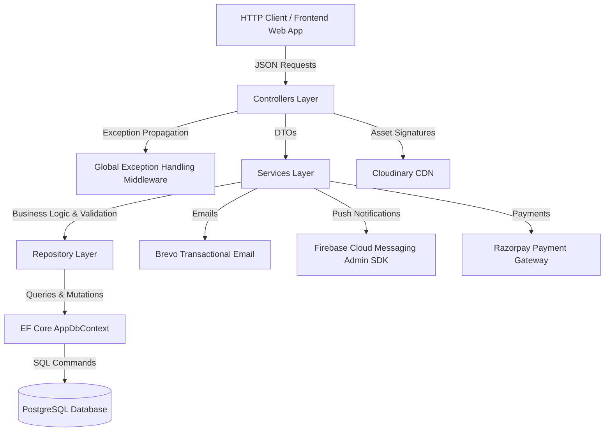
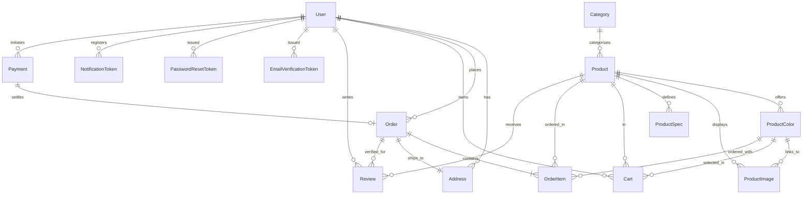

# Cruise3D Backend API Documentation

Welcome to the documentation for the **Cruise3D Web API** backend. Cruise3D is a high-performance e-commerce Web API tailored for customizable physical products (such as 3D prints, custom accessories, and bespoke items). It is built on **.NET 10.0** and powered by **PostgreSQL** using Entity Framework (EF) Core.

---

## 🏗️ Architecture & Core Design Patterns

The Cruise3D backend adheres to an **N-Tier (Layered) Architecture** with clear separation of concerns, ensuring high scalability, testability, and maintainability.



### Key Architectural Patterns

1. **Repository Pattern**: Data access logic is isolated in repository implementations (e.g. `ProductRepository`, `OrderRepository`, `AddressRepository`). Direct EF Core queries are encapsulated behind contracts, keeping services clean and independently testable.
2. **Service Layer**: Business workflows, transactional orchestration, stock reservation, pricing rules, and third-party integrations live strictly in domain services (`OrderService`, `PaymentService`, `AuthService`, `NotificationService`).
3. **Data Transfer Objects (DTOs)**: Inputs and outputs are strictly typed with validation attributes to prevent over-posting vulnerabilities and maintain clean API contracts.
4. **Global Exception Handling Middleware**: Custom `ExceptionMiddleware` catches all unhandled exceptions, maps error messages to appropriate HTTP status codes (`400`, `401`, `404`, `409`, `500`), and produces standardized error responses.
5. **Unified Response Format (`ApiResponse<T>`)**: Every controller endpoint returns a consistent JSON envelope:
   ```json
   {
     "success": true,
     "message": "Action completed successfully.",
     "data": { ... }
   }
   ```
6. **Soft Deletion Mechanism**: Products use soft deletion (`IsActive = false`) rather than hard database deletes, preserving historical order referential integrity.
7. **Background Hosted Sweeper**: A background hosted service (`NotificationTokenSweeper`) periodically sweeps stale FCM notification tokens.

---

## 📂 Project Directory Structure

```text
cruise3d-api/
├── API_DOCUMENTATION.md             # Complete frontend & API reference
├── README.md                        # Project overview & architectural guide
├── cruise3d.slnx                    # Solution file
├── docker/                          # Docker configuration and DB init scripts
│   └── postgres-init/               # PostgreSQL setup scripts
├── scripts/
│   └── seed-admin.ps1               # Automated migration & admin seeder script
├── tools/
│   └── AdminSeeder/                 # Admin user provisioning CLI tool
└── cruise3d/
    ├── cruise3d.API.csproj          # .NET 10 project definition & dependencies
    ├── Program.cs                   # Application entrypoint, DI, & HTTP pipeline
    ├── Dockerfile                   # Multi-stage production container build
    ├── appsettings.json             # Base configuration file
    ├── appsettings.Development.json # Development configuration template
    ├── Controllers/                 # REST API Controllers
    │   ├── AddressController.cs
    │   ├── AdminController.cs
    │   ├── AuthController.cs
    │   ├── CartController.cs
    │   ├── CategoriesController.cs
    │   ├── NewsletterController.cs
    │   ├── NotificationHealthController.cs
    │   ├── NotificationTokensController.cs
    │   ├── OffersController.cs
    │   ├── OrdersController.cs
    │   ├── PaymentController.cs
    │   ├── ProductsController.cs
    │   ├── ReviewsController.cs
    │   ├── TestimonialsController.cs
    │   └── UploadController.cs
    ├── Data/                        # EF Core DbContext & Entity Configurations
    │   ├── AppDbContext.cs
    │   └── Configurations/          # Fluent API mappings & DB constraints
    ├── Helpers/                     # Utilities (JwtHelper, etc.)
    ├── Middleware/                  # HTTP Middleware (ExceptionMiddleware)
    ├── Migrations/                  # EF Core database migrations
    ├── Models/                      # Domain Entities, DTOs & Settings
    │   ├── DTOs/                    # Request & Response payload shapes
    │   ├── Entities/                # Relational database models
    │   └── Settings/                # Options pattern configuration POCOs
    ├── Repositories/                # Database CRUD abstractions & implementations
    │   └── Interfaces/
    └── Services/                    # Business logic & external service integrations
        └── Interfaces/
```

---

## 🗄️ Database Schema & Entity Relations

The database represents a normalized e-commerce schema tailored for customizable and multi-color 3D goods.



### Entity Explanations

1. **User**: Stores registered customer and administrator profiles with passwords securely hashed via BCrypt. Tracks verification state (`IsEmailVerified`, `EmailVerifiedAt`).
2. **EmailVerificationToken**: Manages SHA-256 hashed one-time activation tokens for user registration and email confirmation.
3. **PasswordResetToken**: Manages SHA-256 hashed one-time security tokens for password recovery and account password resets.
4. **NotificationToken**: Stores Firebase Cloud Messaging (FCM) web device tokens with platform metadata, muting controls, and activity timestamps.
5. **Address**: Stores customer shipping addresses formatted for domestic delivery (`FullName`, `AddressLine`, `City`, `State`, `Pincode`, `Phone`, `IsDefault`).
6. **Category**: High-level catalog grouping for products with slug routing and Cloudinary icon support.
7. **Product**: Catalog items supporting fixed or customizable color variants (`ColorType`), stock tracking, dimensions, weight, and materials.
8. **ProductColor**: Selectable color options for customizable items with per-color inventory overrides (`StockOverride`).
9. **ProductImage**: Cloudinary image assets linked optionally to specific color variants.
10. **ProductSpec**: Key-value technical specifications (e.g. Infill, Layer Height, Print Material).
11. **Cart**: Shopping cart items linking user, product, optional color selection, and quantity.
12. **Order**: Purchase transactions capturing snapshot subtotal, flat ₹60 shipping, total amount, status (`pending`, `confirmed`, `printing`, `shipped`, `delivered`, `cancelled`), shipping phone, and DTDC courier tracking ID (`DtdcTrackingId`).
13. **OrderItem**: Immutable order snapshot preserving unit price, quantity, and selected color name/hex at the time of purchase.
14. **Payment**: Tracks Razorpay payment intents, transaction IDs, cart snapshots, and reconciliation status.
15. **Offer**: Time-bounded promotional announcements rendered on the storefront marquee banner.
16. **Review**: Verified customer ratings (1–5) and written feedback linked to products and completed orders.
17. **Testimonial**: Customer quotes submitted for storefront showcase.
18. **NewsletterSubscriber**: Email subscription registry for promotional newsletters.

---

## 🔌 API Endpoints Summary

For complete schema details, see [API_DOCUMENTATION.md](file:///Users/prithvimanoj/Documents/GitHub/cruise3d/cruise3d-api/API_DOCUMENTATION.md).

| Domain | Method | Route | Access | Description |
| :--- | :--- | :--- | :--- | :--- |
| **Auth** | `POST` | `/api/auth/register` | Public | Register customer & send verification email |
| | `POST` | `/api/auth/login` | Public | Login with credentials (returns JWT) |
| | `GET` | `/api/auth/me` | Authenticated | Retrieve current user profile |
| | `POST` | `/api/auth/verify-email` | Public | Verify email with security token |
| | `POST` | `/api/auth/resend-verification` | Public | Re-issue verification email |
| | `POST` | `/api/auth/forgot-password` | Public | Request password reset link via email |
| | `POST` | `/api/auth/reset-password` | Public | Reset account password using token |
| **Addresses** | `GET` | `/api/addresses` | Customer | List customer saved shipping addresses |
| | `POST` | `/api/addresses` | Customer | Create shipping address |
| | `PUT` | `/api/addresses/{id}` | Customer | Update shipping address |
| | `PUT` | `/api/addresses/{id}/default` | Customer | Set address as default |
| | `DELETE` | `/api/addresses/{id}` | Customer | Delete shipping address |
| **Products** | `GET` | `/api/products` | Public | Browse catalog with search, filters & pagination |
| | `GET` | `/api/products/featured` | Public | Fetch featured products |
| | `GET` | `/api/products/bestsellers` | Public | Fetch bestselling products |
| | `GET` | `/api/products/{id}` | Public | Detailed product view with specs & colors |
| | `POST` | `/api/products` | Admin | Create new product with colors/specs |
| | `PUT` | `/api/products/{id}` | Admin | Update existing product |
| | `DELETE` | `/api/products/{id}` | Admin | Soft delete product (`IsActive = false`) |
| **Categories** | `GET` | `/api/categories` | Public | List all categories |
| | `GET` | `/api/categories/with-products` | Public | Categories populated with active products |
| | `GET` | `/api/categories/{id}` | Public | Get category by ID |
| | `POST` | `/api/categories` | Admin | Create category |
| | `PUT` | `/api/categories/{id}` | Admin | Update category |
| | `DELETE` | `/api/categories/{id}` | Admin | Delete category |
| **Cart** | `GET` | `/api/cart` | Customer | View active shopping cart |
| | `POST` | `/api/cart` | Customer | Add product / color to cart |
| | `PUT` | `/api/cart/{cartId}` | Customer | Update item quantity |
| | `DELETE` | `/api/cart/{cartId}` | Customer | Remove single item from cart |
| | `DELETE` | `/api/cart` | Customer | Clear entire cart |
| **Orders** | `POST` | `/api/orders` | Customer | Place order (COD / direct checkout) |
| | `GET` | `/api/orders/my` | Customer | View personal order history |
| | `GET` | `/api/orders/my/{orderId}` | Customer | View specific order & DTDC tracking details |
| | `GET` | `/api/orders` | Admin | List all platform orders with status filter |
| | `PUT` | `/api/orders/{orderId}/status` | Admin | Update lifecycle status (triggers FCM push) |
| | `PUT` | `/api/orders/{orderId}/tracking` | Admin | Set/clear DTDC consignment tracking ID |
| **Payments** | `POST` | `/api/payments/create-order` | Customer | Create Razorpay order & freeze cart snapshot |
| | `POST` | `/api/payments/verify` | Customer | Verify HMAC signature & convert to order |
| | `GET` | `/api/payments/test-connection` | Public | Check Razorpay API credentials health |
| **Offers** | `GET` | `/api/offers/active` | Public | Get active promotional offer for banner |
| | `GET` | `/api/offers` | Admin | List all promotional offers |
| | `GET` | `/api/offers/{id}` | Admin | Get offer by ID |
| | `POST` | `/api/offers` | Admin | Create promotional offer |
| | `PUT` | `/api/offers/{id}` | Admin | Update promotional offer |
| | `DELETE` | `/api/offers/{id}` | Admin | Delete promotional offer |
| **Notifications** | `POST` | `/api/notification-tokens` | Authenticated | Register/upsert device FCM token |
| | `DELETE` | `/api/notification-tokens/{token}` | Public | Unregister device token |
| | `PATCH` | `/api/notification-tokens/{token}/mute` | Authenticated | Toggle notification muting |
| | `GET` | `/api/notifications/health` | Admin | Firebase Admin SDK health check |
| | `POST` | `/api/notifications/dev/test-admin-fcm` | Admin (Dev) | Send test browser notification |
| **Uploads** | `GET` | `/api/upload/signature` | Admin | Generate Cloudinary signed upload payload |
| **Reviews** | `GET` | `/api/reviews/product/{productId}` | Public | List verified reviews for product |
| | `POST` | `/api/reviews` | Customer | Submit verified purchase review |
| | `DELETE` | `/api/reviews/{reviewId}` | Customer | Delete customer review |
| **Admin** | `GET` | `/api/admin/dashboard` | Admin | Aggregate dashboard KPIs & inventory alerts |

---

## 🛠️ Technology Stack

- **Framework**: [.NET 10.0](https://dotnet.microsoft.com/) Web API
- **Language**: C# 14 (file-scoped namespaces, nullable reference types, primary constructors)
- **Database Engine**: [PostgreSQL](https://www.postgresql.org/)
- **ORM**: [Entity Framework Core 10.0](https://learn.microsoft.com/en-us/ef/core/) (Npgsql Provider)
- **Authentication**: JWT Bearer Tokens + BCrypt.Net-Next
- **Payment Processing**: [Razorpay .NET SDK](https://razorpay.com/docs/payments/server-integration/dotnet/)
- **Transactional Email**: [Brevo REST API](https://developers.brevo.com/)
- **Push Notifications**: [Firebase Admin SDK](https://firebase.google.com/docs/admin/setup) (FCM Web Push)
- **Media Asset Storage**: [Cloudinary](https://cloudinary.com/) (Direct signed uploads)
- **Logistics Integration**: DTDC Tracking ID support
- **API Documentation**: OpenAPI / Swagger UI

---

## ⚙️ Configuration & Environment Setup

Configure your connection strings and secrets in `cruise3d/appsettings.Development.json` or via environment variables:

```json
{
  "ConnectionStrings": {
    "DefaultConnection": "Host=localhost;Port=5432;Database=cruise3d;Username=postgres;Password=your_password"
  },
  "Jwt": {
    "Key": "YourSuperSecretKeyWithAtLeast32CharactersLong!",
    "Issuer": "cruise3d-api",
    "Audience": "cruise3d-client",
    "ExpiryMinutes": 60
  },
  "Razorpay": {
    "Key": "rzp_test_YourKeyId",
    "Secret": "YourRazorpaySecret"
  },
  "Cloudinary": {
    "CloudName": "your-cloud-name",
    "ApiKey": "your-api-key",
    "ApiSecret": "your-api-secret"
  },
  "Firebase": {
    "CredentialsPath": "secrets/firebase-adminsdk.json"
  },
  "App": {
    "PublicUrl": "http://localhost:5173"
  },
  "Brevo": {
    "ApiKey": "your-brevo-api-key",
    "SenderEmail": "no-reply@cruise3d.com",
    "SenderName": "Cruise3D",
    "EnabledInDevelopment": true
  },
  "EmailVerification": {
    "TokenLifetimeMinutes": 1440,
    "VerificationPath": "/verify-email"
  }
}
```

---

## 🚀 Running the Application Locally

### 1. Start PostgreSQL
Run PostgreSQL locally or via Docker:
```bash
docker run --name cruise3d-postgres -e POSTGRES_PASSWORD=postgres -e POSTGRES_DB=cruise3d -p 5432:5432 -d postgres:16-alpine
```

### 2. Apply EF Core Migrations
Automatic migration is applied during startup. To run migrations manually:
```bash
dotnet ef database update --project cruise3d/cruise3d.API.csproj --startup-project cruise3d/cruise3d.API.csproj
```

### 3. Seed the Administrator Account
Use the provisioning PowerShell script or AdminSeeder CLI tool:
```powershell
.\scripts\seed-admin.ps1 -Password 'Admin@1234!'
```
*Alternatively:*
```bash
dotnet run --project tools/AdminSeeder/AdminSeeder.csproj -- 'Admin@1234!' "Host=localhost;Port=5432;Database=cruise3d;Username=postgres;Password=postgres"
```

### 4. Start the Web API
```bash
cd cruise3d
dotnet run
```
Access the Swagger documentation in your browser at:
```http
http://localhost:5000/swagger
```
