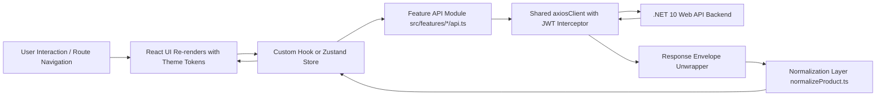

# Cruise3D Frontend — Architecture & Developer Guide

Welcome to the **Cruise3D** frontend codebase. This document serves as the primary technical architecture guide and onboarding handbook for developers working on the Cruise3D client application.

Cruise3D is a modern, high-performance 3D printing & additive manufacturing e-commerce platform. The frontend connects to a **.NET 10 Web API** backend with PostgreSQL and Entity Framework Core.

---

## 1. System & Technology Stack

| Layer / Concern | Technology | Purpose & Selection Rationale |
| :--- | :--- | :--- |
| **Framework & Language** | **React 19** + **TypeScript (~6.0)** | Modern component paradigm with strong static type safety and JSX runtime improvements. |
| **Build Tool & Bundler** | **Vite 8** (`@vitejs/plugin-react`) | Sub-second Hot Module Replacement (HMR) and fast ES-module based development server. |
| **Styling & Design System** | **Tailwind CSS v4** + Design Tokens | Utility-first styling combined with a centralized design token system (`src/styles/theme.ts`). |
| **Client Routing** | **React Router v7** (`react-router-dom`) | Declarative client-side routing with nested layouts, history management, and route guards (`ProtectedRoute`, `AdminRoute`). |
| **Client-Side State** | **Zustand 5** (`zustand/middleware`) | Lightweight state management for global domains (Auth session, Cart item drawer, Wishlist) with `localStorage` persistence. |
| **Server State & Networking**| **Axios** + **TanStack Query v5** | Centralized HTTP client (`axiosClient`) with automatic JWT bearer attachment, 401 interception, and backend envelope unwrapping. |
| **Forms & Validation** | **React Hook Form** + **Zod 4** | Type-safe form management and schema validation via `@hookform/resolvers/zod`. |
| **Iconography & Fonts** | **Material Symbols Outlined** + **Inter** | Google Material Symbols font and Inter typography for industrial blueprint aesthetics. |

---

## 2. Architectural Principles & Patterns

### 2.1 Feature-Driven Vertical Slice Architecture
The application is organized around domain **features** (`src/features/*`) rather than generic technical layers. Each feature is self-contained and encapsulates:
- **`types.ts`**: TypeScript domain interfaces, request/response types, and UI state models.
- **`api.ts`**: Axios-based network functions calling specific backend REST endpoints.
- **`components/`**: Feature-specific UI components (cards, filters, tables, modals).
- **`pages/`**: View-level components mapped directly to router paths.
- **`hooks/`** *(optional)*: Reusable hooks and business logic.
- **`normalize*.ts`** *(optional)*: Transformation layer bridging backend schema variations (e.g. PascalCase vs camelCase, nested images) into clean UI types.

### 2.2 Unwrapped API Response Envelope Pattern
The .NET backend returns responses wrapped in an `ApiResponse<T>` envelope:
```json
{
  "success": true,
  "data": { ... },
  "message": "Operation successful",
  "errors": []
}
```
The shared `src/api/axiosClient.ts` intercepts all responses:
- Automatically unpacks `response.data.data` so feature code receives type `T` directly.
- Rejects promises on `{ success: false }` or HTTP `4xx`/`5xx` errors.
- Attaches the JWT Bearer token from `localStorage.getItem('accessToken')`.
- Broadcasts a custom `window.dispatchEvent('auth:logout')` event on `401 Unauthorized` for smooth session invalidation.

---

## 3. End-to-End Data & Execution Flow



### Step-by-Step Request Lifecycle:
1. **User Action / Page Mount**: A page component (e.g. `ProductListPage`) or hook initiates data fetching.
2. **API Request**: The feature API (e.g. `getProducts(params)`) calls `axiosClient.get('/products', { params })`.
3. **Request Interception**: `axiosClient` reads the active `accessToken` from `localStorage` and injects `Authorization: Bearer <token>` header.
4. **Backend Processing**: The .NET 10 API handles the request and responds with `{ success: true, data: [...] }`.
5. **Response Interception**: `axiosClient` verifies `success === true`, extracts `data`, and returns the payload to caller.
6. **Data Normalization**: Adapters (such as `normalizeProducts()`) sanitize backend properties and fill default fallbacks.
7. **State Update & Render**: Zustand stores or component states update, re-rendering UI components with standard token-based styling.

---

## 4. Codebase Directory Structure

```text
cruise3d-clientside/
├── public/                          # Static assets and icons
│   └── favicon.svg
├── src/
│   ├── main.tsx                     # Application bootstrap & DOM mount
│   ├── App.tsx                      # Root component wrapping AuthProvider & AppRouter
│   ├── index.css                    # Tailwind CSS imports & global keyframe animations
│   │
│   ├── api/                         # Global networking infrastructure
│   │   └── axiosClient.ts           # Configured Axios instance with auth & response interceptors
│   │
│   ├── app/                         # Application-level bootstrapping
│   │   ├── providers/
│   │   │   └── AuthProvider.tsx     # Session hydration & auth-logout event listener
│   │   ├── router/
│   │   │   ├── AppRouter.tsx        # React Router routes definition & layout mounting
│   │   │   ├── ProtectedRoute.tsx   # Route guard: redirects unauthenticated users to /login
│   │   │   └── AdminRoute.tsx       # Route guard: requires role === 'admin'
│   │   └── store/
│   │       └── authStore.ts         # Zustand store for user session and JWT tokens
│   │
│   ├── components/                  # Shared & Cross-cutting UI
│   │   ├── layout/
│   │   │   ├── Header.tsx           # Brand header with nav links, search, and cart indicator
│   │   │   ├── Footer.tsx           # Company links, newsletter signup, and copyright
│   │   │   ├── MainLayout.tsx       # Application shell (Header + <Outlet /> + Footer + CartDrawer)
│   │   │   └── AdminSidebar.tsx     # Admin dashboard navigation sidebar
│   │   └── ui/                      # Primitive Design System components
│   │       ├── Button.tsx           # Polished button with variants, sizes, and spinner state
│   │       ├── Input.tsx            # Form input with validation error states and icons
│   │       ├── Modal.tsx            # Accessible dialog using React Portals with backdrop blur
│   │       ├── Spinner.tsx          # SVG animated loading indicator
│   │       ├── Toast.tsx            # Alert / Toast notification banner
│   │       └── Pagination.tsx       # Dynamic pagination bar with ellipsis support
│   │
│   ├── features/                    # Domain-Driven Feature Slices
│   │   ├── auth/                    # Login, Register, Password recovery & JWT session
│   │   ├── products/                # Catalog list, product details, filters, 3D gallery
│   │   ├── cart/                    # Persistent shopping cart, drawer, line-item pricing
│   │   ├── orders/                  # Multi-step checkout stepper, order tracking, history
│   │   ├── profile/                 # User dashboard, address book, security settings
│   │   ├── categories/              # Category browsing and admin taxonomy management
│   │   ├── reviews/                 # Product review lists, rating submission form
│   │   ├── wishlist/                # User saved items / wishlist management
│   │   ├── testimonials/            # Customer testimonials showcase
│   │   ├── customers/               # Admin customer directory & account auditing
│   │   ├── newsletter/              # Newsletter subscription and admin subscriber lists
│   │   └── admin/                   # Admin metrics, stock management, order status updater
│   │
│   ├── lib/                         # Shared utility functions
│   │   ├── formatCurrency.ts        # Currency and price formatting
│   │   ├── formatDate.ts            # Date and timestamp formatting
│   │   └── validators/              # Common validation helpers & schemas
│   │
│   ├── pages/                       # Standalone top-level pages
│   │   ├── HomePage.tsx             # Landing page with hero banner & featured grid
│   │   └── UIDemo.tsx               # Design system showcase page (/ui-demo)
│   │
│   ├── styles/
│   │   └── theme.ts                 # Kinetic Precision theme tokens (colors, spacing, shadows)
│   │
│   └── types/
│       └── api.ts                   # Generic API response and pagination interfaces
│
├── package.json
├── tsconfig.json
├── tsconfig.app.json
└── vite.config.ts
```

---

## 5. Design System: Kinetic Precision

The Cruise3D interface is engineered around the **Kinetic Precision** design system — evoking high-fidelity additive craftsmanship and industrial sophistication.

All design tokens are centralized in [`src/styles/theme.ts`](file:///c:/cruise3D/cruise3d-clientside/src/styles/theme.ts).

### 5.1 Color Palette
- **Primary / Dark Accent:** `#1a1a1a` (Charcoal / Solid Action) with hover `#0d0d0d`.
- **Secondary / Slate:** `#404040` / `#737373` for secondary actions and subtle borders.
- **Surface & Cards:** `#ffffff` (`surface.DEFAULT`) and `#fafafa` (`surface.container`).
- **Page Background:** `#f4f3f0` (Warm industrial off-white canvas).
- **Status Accents:** Success (`#16a34a`), Error (`#dc2626`), Warning (`#eab308`), Info (`#0284c7`).

### 5.2 Elevation & Motion
- **Ambient Shadow:** `0 4px 20px rgba(0,0,0,0.04)` (clean, non-muddy elevation).
- **Lift Micro-interaction:** Hover transformations (`scale-[1.02]`, transition durations `200ms`).
- **Rounded Radii:** Containers (`16px`/`rounded-2xl`), Buttons & Inputs (`8px`/`rounded-lg`), Chips/Pills (`9999px`/`rounded-full`).

---

## 6. Authentication, Session & Routing Security

### 6.1 Authentication Flow
1. User logs in via `LoginPage` -> calls `loginApi(credentials)`.
2. Backend responds with JWT `accessToken`, `refreshToken`, and user payload (`User` model with `role`).
3. `useAuthStore.getState().login(user, token, refreshToken)` persists credentials in `localStorage` (`accessToken`, `refreshToken`, `cruise3d-auth`).
4. `AuthProvider` listens for app boot: if a token exists, it calls `getMe()` to rehydrate profile data and synchronizes the user's server cart.

### 6.2 Route Guards
- **`ProtectedRoute`**: Inspects `isAuthenticated`. Redirects unauthorized visitors to `/login`, preserving `state: { from: location }` for redirect after authentication.
- **`AdminRoute`**: Checks both `isAuthenticated` and `user.role === 'admin'`. Non-admin authenticated users are redirected to `/`.

---

## 7. Routes Map

| Route URL | Page Component | Access Level | Description |
| :--- | :--- | :--- | :--- |
| `/` | `HomePage` | Public | Hero banner, value propositions, featured grid |
| `/products` | `ProductListPage` | Public | Search, filters (technology, material, price), pagination |
| `/products/:productId` | `ProductDetailPage` | Public | 3D gallery, finish picker, specs tab, reviews, Add to Cart |
| `/cart` | `CartPage` | Public | Item table, quantity steppers, summary card, checkout CTA |
| `/checkout` | `CheckoutPage` | Authenticated | 5-step checkout: billing, shipping, payment, confirmation |
| `/orders` | `OrderDetailPage` / Placeholder | Authenticated | Customer order history and timeline |
| `/orders/:orderId` | `OrderDetailPage` | Authenticated | Detailed order status (Placed → Processing → Printing → Shipped) |
| `/login` | `LoginPage` | Public / Guest | Sign in with email/password and social login options |
| `/register` | `RegisterPage` | Public / Guest | Account creation with form validation |
| `/profile` | `UserProfilePage` | Authenticated | Profile info, address manager, security settings |
| `/testimonials` | `TestimonialsPage` | Public | Customer reviews and community showcases |
| `/wishlist` | `WishlistPage` | Public / Guest | Saved favorite products |
| `/ui-demo` | `UIDemo` | Development | Live component sandbox for UI inspection |
| `/admin` | `AdminDashboardPage` | Admin only | Revenue charts, stats cards, low stock alerts |
| `/admin/products` | `AdminProductsPage` | Admin only | Product catalog management and CRUD operations |
| `/admin/orders` | `AdminOrdersPage` | Admin only | Order status management and fulfillment pipeline |
| `/admin/categories` | `AdminCategoriesPage` | Admin only | Category taxonomy editor |
| `/admin/testimonials`| `AdminTestimonialsPage` | Admin only | Customer review moderation |

---

## 8. Development & Build Workflow

### 8.1 Prerequisites
- **Node.js**: >= 20.x
- **Package Manager**: `npm` (v10+)
- **Backend API**: Running on `http://localhost:5000` (or configured in `.env`)

### 8.2 Environment Configuration
Create a `.env` file in the repository root (`C:\cruise3D`) or export the same
variables in your shell before starting Vite:
```env
VITE_API_BASE_URL=http://localhost:5000/api
```

The Vite config loads env files from the repo root, so the same `.env` file
works for local `npm run dev` and the Docker Compose frontend services.

### 8.3 Key NPM Scripts

| Command | Action |
| :--- | :--- |
| `npm run dev` | Starts Vite local development server on `http://localhost:5173`. |
| `npm run build` | Runs TypeScript compilation (`tsc -b`) followed by production Vite bundling to `/dist`. |
| `npm run preview` | Runs a local web server serving the generated production `/dist` bundle. |
| `npm run lint` | Executes ESLint to check for code quality and style issues. |

---

## 9. Coding Guidelines for Contributors

1. **TypeScript Type Imports**: Always use explicit type imports (`import type { Product } from './types'`) to support TypeScript `verbatimModuleSyntax` and fast Vite bundling.
2. **Path Aliases**: Always use `@/*` to reference modules under `src/` (e.g. `import { Button } from '@/components/ui/Button'`).
3. **No Direct Mutation**: Always update Zustand and React state immutably.
4. **Use Shared Theme Tokens**: When writing custom styled components or inline styles, import tokens from `@/styles/theme`. Avoid hardcoded arbitrary color hex codes in component files.
5. **API Response Safety**: Use the shared `axiosClient` for all backend communications; never initiate raw `fetch()` calls for API endpoints.
